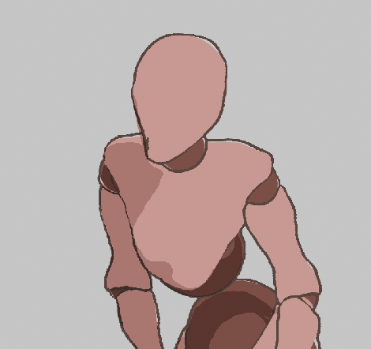

# KiyouSen.github.io

## [faceapi test](https://kiyousen.github.io/faceapi/)

based on [face-api.js](https://github.com/justadudewhohacks/face-api.js)

## [opencv js test](https://kiyousen.github.io/cvjs/)

from [opencvjs-facedetect-livedemo](https://github.com/mecab/opencvjs-facedetect-livedemo)

## [opencv js on main thread test](https://kiyousen.github.io/cvjs_mainthread/)

from [opencvjs-facedetect-livedemo](https://github.com/mecab/opencvjs-facedetect-livedemo)

1. aaaa
   1. c
   2. d 

2. bbbb
   1. c
   2. d 
3. cccc
   1. c
   2. d 

3. cccc

